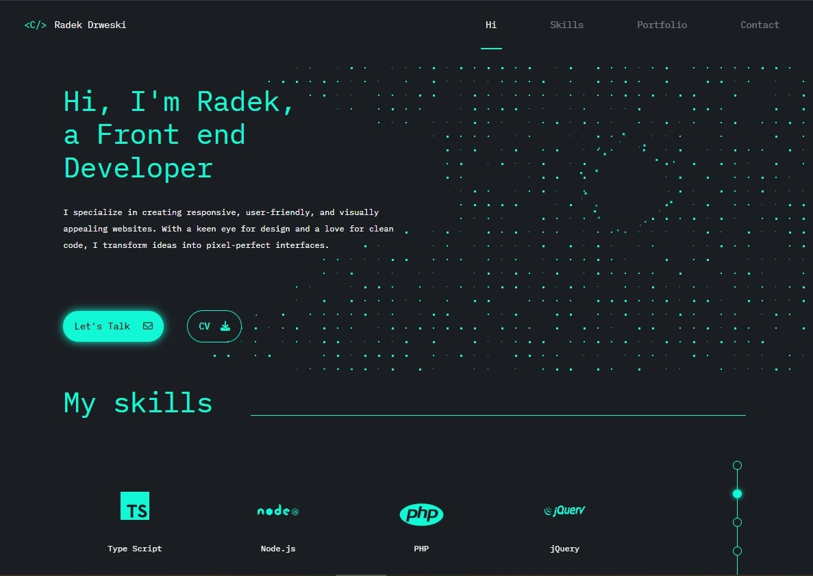

# Personal Portfolio Website

Welcome to my personal portfolio website. This website is designed to showcase my skills, projects, and provide a way to contact me. Below you'll find a detailed description of the website's features and how to set it up on your local machine.

## Table of Contents

- [Project Overview](#project-overview)
- [Features](#features)
  - [Navigation](#navigation)
  - [Header](#header)
  - [Skills Section](#skills-section)
  - [Projects Section](#projects-section)
  - [Contact Section](#contact-section)
- [Technology Stack](#technology-stack)
- [Installation](#installation)
- [Usage](#usage)
- [Contributing](#contributing)
- [License](#license)
- [Contact](#contact)

## Project Overview



## Features

### Navigation

- **Fixed Navigation Bar**: The navigation bar remains fixed at the top of the page while scrolling.
- **Animated Navigation Buttons**: Navigation buttons feature smooth jQuery animations, seamlessly scrolling to each section on click.
- **Responsive Burger Menu**:
  - When the page width is 480px or less, the navigation links transform into a burger menu.
  - The burger icon is animated with CSS: when closed, it shows three lines; when opened, it transforms into an arrow indicating how to close the menu.
  - When the burger menu is open, the background is blurred. Clicking anywhere on the blurred background closes the menu.

### Header

- **Intro Section**: Includes an introductory message with a JavaScript animation effect using classes and canvas

### Skills Section

- **Skills Display**: Skills are displayed with images (SVG's) and descriptions.
  - **Desktop View**: Displays 4 images per row.
  - **Mobile View**: Displays 2 rows with 2 images per row.
- **Skills Slider Functionality**:
  - The skills section automatically cycles through groups of four skills every 4 seconds using `setInterval`. A progress bar with dots and connecting lines is generated dynamically—each dot represents one set of skills. Clicking on a dot resets the timer, highlights the selected dot, and displays the corresponding skills group, ensuring the animation continues smoothly from that point.

### Recent Works Section

- **Project Display**: Presents a list of my projects. Each project includes a screenshot, a short description, a list of the technologies used, and buttons linking to the source code and live demo.

### Contact Section

#### Input Animations

- Floating Labels: Labels are styled as placeholders inside input fields.
- Focus Animation: On focus, the label moves above the field and a bottom underline slides in from the left.
- Blur Behavior: If the input is empty on blur, the label and underline revert; filled inputs keep the label above. All animations are handled purely with CSS

#### Form Validation Flow

The contact form has two layers of validation: frontend and backend.

- **Required Fields**: All inputs must be filled to submit the form. If validation fails, a clear error message appears below the form
- **Validation Rules**:
  - **Name**: max 50 characters
  - **Email**: max 254 characters, must match a valid email format (regex applied on frontend and backend)
  - **Message**: max 2000 characters, with a live character counter displayed below the field
- **Backend Validation**: Once frontend validation passes, the backend applies the same rules for consistency. If validation fails, it responds with status 400 and an error object (e.g., { name: "REQUIRED" }, { email: "INVALID" }). This approach improves maintainability, as validation logic is centralized—changes need to be made only once to affect both layers. Error messages are kept identical between frontend and backend so the user isn’t confused or frustrated by different wording. From the user’s perspective, an error is simply an error—the important part is knowing what to fix, not where the validation failed
- **Error Handling**: On the frontend, `showBackendValidationErrors` maps backend error codes to the same messages as frontend validation, ensuring consistent and maintainable feedback.

#### Form Submission

- **Pre-check**: Before validation or submission, the internet connection is verified (`navigator.onLine`) to prevent sending the form without access
- **Spam Protection:**: The contact form uses Google reCAPTCHA v3 to block spam and bots. Tokens are generated on the frontend and verified in an AWS Lambda function, with the secret key securely stored in Lambda
- **Data Transmission**: The form data is sent to the backend through AWS API Gateway using axios with the POST method. Axios simplifies request handling, while POST securely transmits the data in the request body
- **Loading & Feedback**: While sending, a loading overlay prevents further interaction and a spinner is displayed. On success, the form resets and a success message appears for 4 seconds
- **Error Handling**:
  - 400 – form validation failed on the backend (e.g., missing required fields)
  - 403 – reCAPTCHA verification failed (forbidden)
  - 404 – resource not found (e.g., wrong API endpoint)
  - 500+ – internal server error (e.g., unhandled exception or server failure)

## Troubleshooting

### Lambda Timeout

- **Default timeout:** 3s
- **Problem:** too short for function (reCAPTCHA + SES)
- **Impact:**
  - Lambda terminated before returning response to API Gateway
  - API Gateway returned an error to the client
  - In some cases SES still managed to send the email → inconsistent UX
- **Solution:** increased timeout to **10s**
- **Prevention:** set up **CloudWatch Alarm** on Lambda duration metric to notify by email if execution time approaches the limit

## Technology Stack

- **Frontend**

  - **HTML5, CSS3, SASS** – structure, styling, and CSS preprocessing
  - **JavaScript (ES6+) & jQuery** – client-side logic, form validation, and event handling
  - **Webpack** – bundling and optimization of frontend assets

- **Backend & Infrastructure**

  - **AWS Lambda (Node.js)** – serverless backend handling contact form submissions
  - **AWS API Gateway** – API entry point for `POST` requests from the frontend
  - **AWS SES** – sending emails with the submitted form data
  - **AWS Route 53** – DNS management and domain hosting

- **Architecture Diagram**

```mermaid
flowchart LR
    U[User] -->|Form Submission| AGW["API Gateway"]
    AGW --> L["Lambda"]
    L --> SES["SES"]
    U <--|Success / Error Response| AGW

    %% Simple note without styling
    L -.-> N["⚠️ Timeout issue: Default 3s too short, increased to 10s"]
```

### General

- **Responsive Design**: The website is fully responsive and works on all devices
- **SEO and Social Media Meta Tags**: The website includes SEO enhancements and meta tags for better visibility on search engines and social media platforms
- **Webpack Configuration**: The project uses Webpack for bundling

## Installation

### Prerequisites

- Ensure you have Node.js, npm, PHP, and Composer installed on your machine.

### Steps

1. **Clone the Repository**:

   ```bash
   git clone https://github.com/radek-drw/Portfolio.git
   cd radek-drweski-portfolio
   ```

````

2. **Install dependencies**:

   ```bash
   npm install
   composer install
   ```

3. **Start the Development Server**:

   ```bash
   npm start
   ```

   This will start the development server and open the website in your default browser.

4. **Build for Production**:

   ```bash
   npm run build
   ```

This will create an optimized production build in the dist folder.

## Usage

- Navigation: Use the top navigation bar to jump to different sections of the website.
- Skills and Projects: Click on the dots in the skills and projects sections to navigate through different items.
- Contact Form: Fill in the contact form to get in touch with me. Ensure all fields are filled correctly before submitting.

## Contributing

If you would like to contribute to this project, please fork the repository and use a feature branch. Pull requests are warmly welcome.

## License

This project is open source and available under the MIT License.

## Contact

If you have any questions or feedback, feel free to contact me at [rdrweski@gmail.com].

Thank you for visiting my portfolio website!
````
